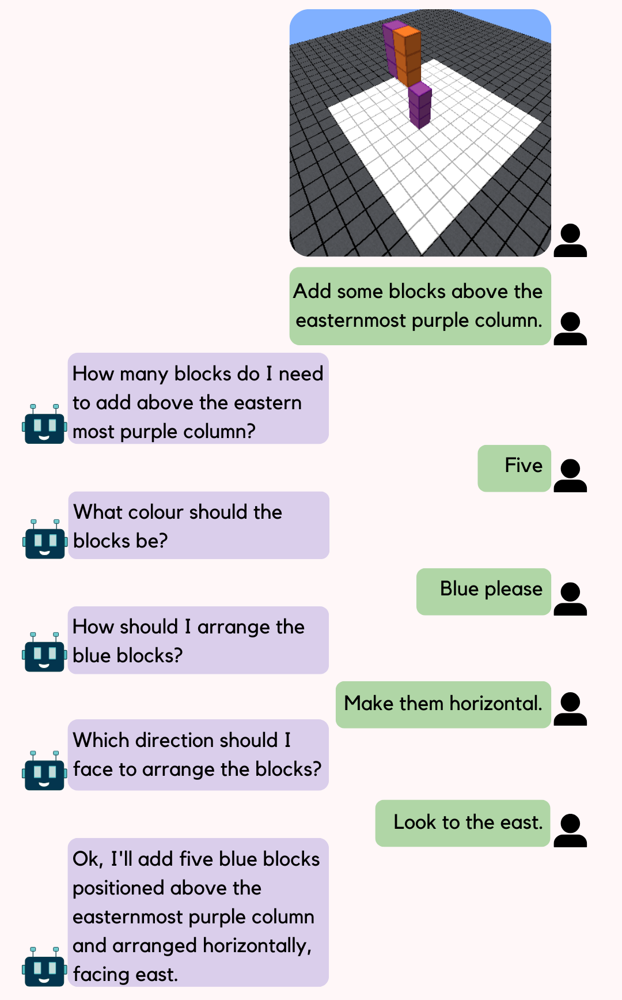
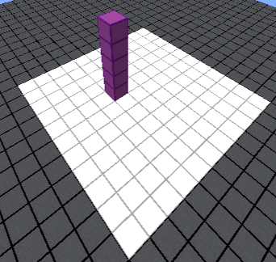
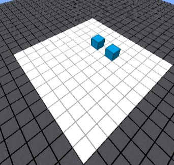
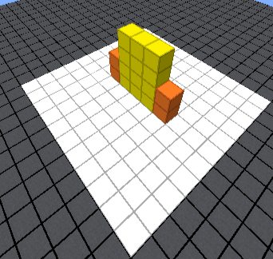

# CODE

## Introduction

In this repository, we share the training, testing, and evaluation code for **Training Multi-Modal LLMs through Dialogue Planning for HRI**, and we report only the method and results for MiniCPM since LLaVA was used just as a comparison for the first step.  
The goal of this project is to develop a Multi-Modal Large Language Model (MLLM) capable of engaging in a dialogue within a Minecraft-like environment.  



The interaction is based on an image of the world and user-provided commands. The user acts as the **Architect**, dictating tasks to be performed, while the MLLM acts as the **Builder**, gathering necessary information by observing the world or asking clarifying questions. The system will then confirm or reject the command.  

Our experiments demonstrate that incorporating a structured planning phase during the dialogue improves the clarity, ease, and overall effectiveness of the interaction. The released systems are trained on the dataset to generate either relevant questions or confirmations about the executability of a command.  

The repository contains two systems:
1. **Fine-tuned with Plan**: This system works in two steps:
    - **Step 1**: Given the dialogue history, the image, and the last user utterance, it generates a plan for gathering the required information.
    - **Step 2**: Using the dialogue history, the image, the last user utterance, and the generated plan, the system produces a relevant question based on the first category of the plan.
2. **Fine-tuned no Plan**: This system directly generates a question or a confirmation for the user without planning the dialogue.

---

## Pre-requisites

1. **Download the base model**: obtain the MiniCPM-V 2.6 base model from the Huggingface repository and store the model in your local disk
2. **Edit the base model**: in the model main folder replace the _modeling_minicpmv.py_ file with the customized one that you can find in this repo under the folder _minicpm_edited_files_.

---

## Training

To train the models, follow these steps:

1. **Set up the environment**:
    Create a virtual environment and install the required packages using the following commands:

    ```
    # Create new environment
    conda create --name minicpm_env python=3.10 -y

    #activate environment
    conda activate minicpm_env

    #Instal packages
    pip install -r requirements_sft.txt

    ```

2. **Run the training scripts**:
    Use the appropriate bash script to train the desired model (split for both English and Italian). Run in the _finetuning/finetune_ folder:
    - **Fine-tuned with Plan (EN)**: `sh finetune_lora_ENG_history_plan.sh`
    - **Fine-tuned no Plan (EN)**: `sh finetune_lora_ENG_history_noplan.sh`
    - **Fine-tuned with Plan (IT)**: `sh finetune_lora_ITA_history_plan.sh`
    - **Fine-tuned no Plan (IT)**: `sh finetune_lora_ITA_history_noplan.sh`

    **Arguments**:
    - **MODEL**: path to the base MiniCMP-V 2.6 model
    - **DATA**: path to the train data folder 
    - **EVAL_DATA**: path to the eval data folder
    - **LLM_TYPE**: defines how to process the data and construct the appropriate conversation input to train the model. It is set to the custom implementation 'qwen2_mmiglu'.
    - **tune_vision**: boolean. Enable the SigClip VIsion Encoder weights adjustment
    - **output_dir**: define the directory to save LoRA weights

---

## Testing

To evaluate the models, generate answers for the test set. The evaluation metrics will be computed in the next step. 

In the _evaluation_ folder:

1. **Run the testing scripts**:
    Use the following bash scripts:
    - **Fine-tuned with Plan**: `sh evaluation_plan_model.sh`
    - **Fine-tuned no Plan**: `sh evaluation_noplan_model.sh`
    - **0-Shot (a simple baseline)**: `sh evaluation_ZS_model.sh`

   **Arguments**:
    - **LANGUAGE**:the language configuration for evaluation. Allowed parameters are:'en', 'it', 'en2it', 'it2en'.
                    'en' and 'it' evaluate the model trained and tested in the same language.
                    'en2it' and 'it2en' are used for cross-lingual evaluation, where the model is trained in one language but tested in another.
    - **NAME**: name for the output .tsv file(s), which is(are) used in the next step
    - **MODEL_TYPE**: path to the base model
    - **PATH_TO_ADAPTER**: path to the LoRA weights

---

## Evaluation
1. **Set up the environment**:
    Create a virtual environment and install the required packages using the following commands:

    ```
    # Create new environment
    conda create --name eval_env python=3.10 -y

    #activate environment
    conda activate eval_env

    #Instal packages
    pip install -r requirements_eval.txt

    ```
To produce the evaluation metrics, run the provided scripts, in the _evaluation_ folder:

2. **Evaluation scripts**: `name_of_tsv_file.tsv` should be the same as the output of the previous step
    - **Compute Plan metrics**: 
    ```
    python calculate_plan_metrics.py name_of_tsv_file.tsv
    ```
    - **Compute metrics about Clarifications Request quality**:
    ```
    python question_accuracy.py name_of_tsv_file.tsv
    ```
    - **Compute metrics about Recap quality**:
    ```
    python calculate_conf_recap_metrics.py name_of_tsv_file.tsv
    ```

    ---

    # DATA

    ## Introduction
    
    In this repository, we share also the dataset related to **Training Multi-Modal LLMs through Dialogue Planning for HRI**.  
    The dataset focuses on Dialogical Interaction in a Minecraft-like environment and is bilingual, i.e., it contains dialogues in both Italian and English. The data is divided into train/eval/test sets with a ratio of 80/10/10.
    
    ---
    
    ## Dataset Structure
    
    The dataset is structured as follows:
    ```
    - data
      |--images
      |--it
        |--plan
            |--train.json
            |--eval.json
            |--test.json
        |--noplan
            |--train.json
            |--eval.json
            |--test.json
      |--en
        |--plan
            |--train.json
            |--eval.json
            |--test.json
        |--noplan
            |--train.json
            |--eval.json
            |--test.json
    ```
    
    ### Example Dialogue
    
    Below is an example of a short dialogue extracted from the dataset: a dialogue between a _user_ and an _assistant_ interacting with a block environment. The _user_ provides commands on how to arrange the blocks, while the _assistant_ interprets the request and generates a response based on its understanding of the scene.
    
    ```
    "id": "CQ-game-2438_068816_noplan",
    "image": "../../images/CQ-game-2438.png",
    "lang": "en",
    "image_id": "CQ-game-2438",
    "conversations": [
        {
        "role": "user",
        "content": "Add blocks above the easternmost purple column"
        },
        {
        "role": "assistant",
        "content": "How many blocks do I need to add above the easternmost purple column?"
        },
        {
        "role": "user",
        "content": "Three"
        },
        {
        "role": "assistant",
        "content": "What color should the three blocks be?"
        },
        {
        "role": "user",
        "content": "Yellow"
        },
        {
        "role": "assistant",
        "content": "How should I arrange the three yellow blocks?"
        },
        {
        "role": "user",
        "content": "Vertically"
        },
        {
        "role": "assistant",
        "content": "Ok, I'll add three yellow blocks arranged vertically above the easternmost purple column"
        }
    ```
    
    Below is an example of a short dialogue extracted from the dataset: a dialogue between a _user_ and _assistant_ interacting with a block environment. The _user_ provides a command to add blocks, and the _assistant_  responds by generating a structured _plan_ to clarify ambiguities before executing the request. The conversation follows a step-by-step process where the _assistant_ asks for missing details (such as the number, color, and arrangement of the blocks) before confirming the final action.
    
    
    ### Example Dialogue Plan Augmented
    ```
    "id": "CQ-game-2438_068816_plan",
    "image": "../../images/CQ-game-2438.png",
    "lang": "en",
    "image_id": "CQ-game-2438",
    "conversations": [
        {
        "role": "user",
        "content": "Add blocks above the easternmost purple column"
        },
        {
        "role": "plan",
        "content": "['NUMBER', 'COLOR', 'DISPOSITION', 'CONFIRMATION WITH RECAP']"
        },
        {
        "role": "assistant",
        "content": "How many blocks do I need to add above the easternmost purple column?"
        },
        {
        "role": "user",
        "content": "Three"
        },
        {
        "role": "plan",
        "content": "['COLOR', 'DISPOSITION', 'CONFIRMATION WITH RECAP']"
        },
        {
        "role": "assistant",
        "content": "What color should the three blocks be?"
        },
        {
        "role": "user",
        "content": "Yellow"
        },
        {
        "role": "plan",
        "content": "['DISPOSITION', 'CONFIRMATION WITH RECAP']"
        },
        {
        "role": "assistant",
        "content": "How should I arrange the three yellow blocks?"
        },
        {
        "role": "user",
        "content": "Vertically"
        },
        {
        "role": "plan",
        "content": "['CONFIRMATION WITH RECAP']"
        },
        {
        "role": "assistant",
        "content": "Ok, I'll add three yellow blocks arranged vertically above the easternmost purple column"
        }
    ```
    
    
    
    ---
    
    ## Images
    
    Due to space constraints, only a subset of the images is included in this repository to give an overview of the dataset.  
    
    ### Example Images
    
    Below are three sample images from the dataset:
    
    <div style="text-align: center;">
        <figure style="display: inline-block; margin: 10px;">
            
            <figcaption>CQ-game-2702</figcaption>
        </figure>
        <figure style="display: inline-block; margin: 10px;">
            
            <figcaption>CQ-game-6796</figcaption>
        </figure>
        <figure style="display: inline-block; margin: 10px;">
            
            <figcaption>CQ-game-8747 </figcaption>
        </figure>
    </div>
    
    